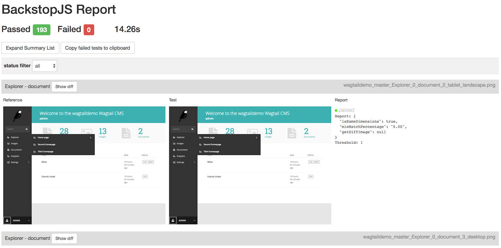
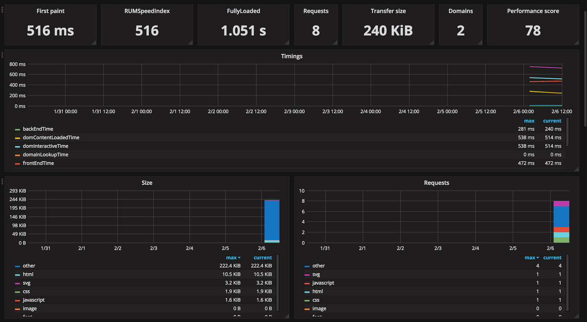
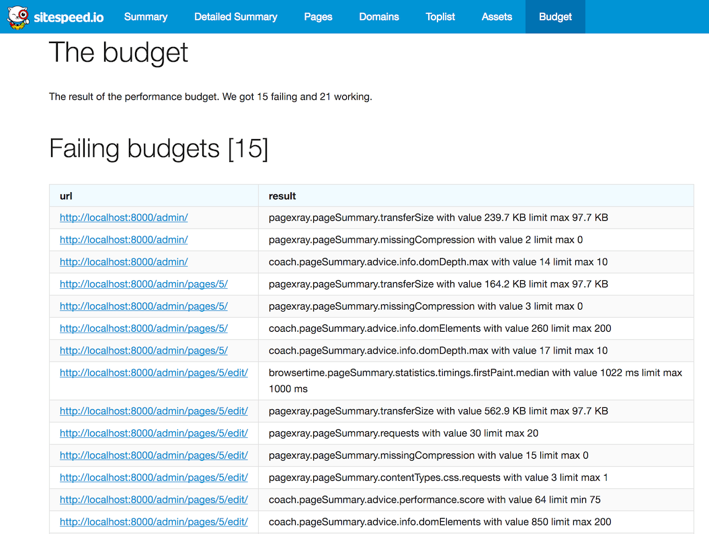
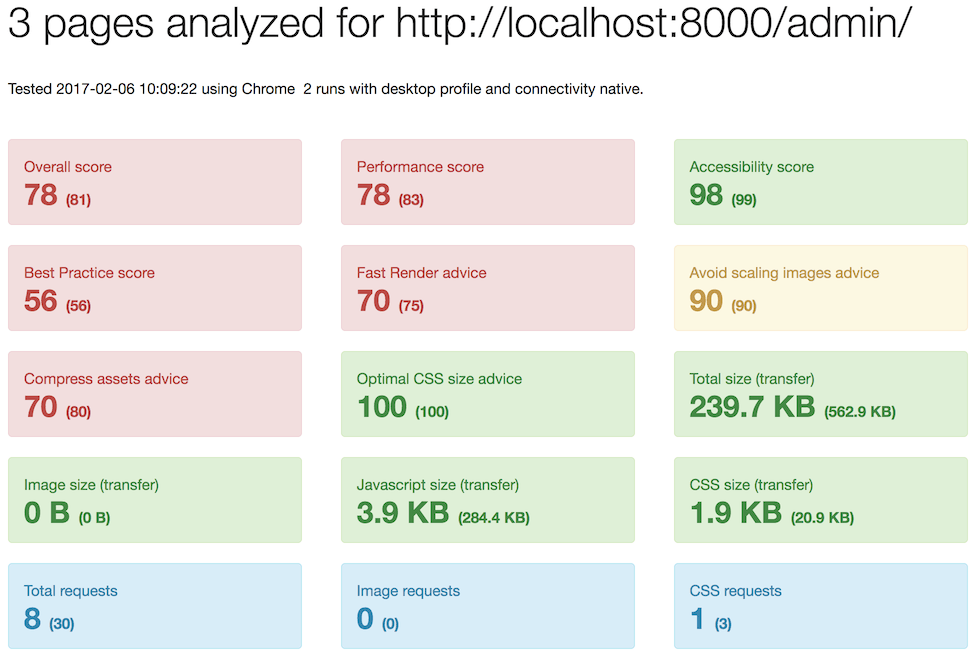
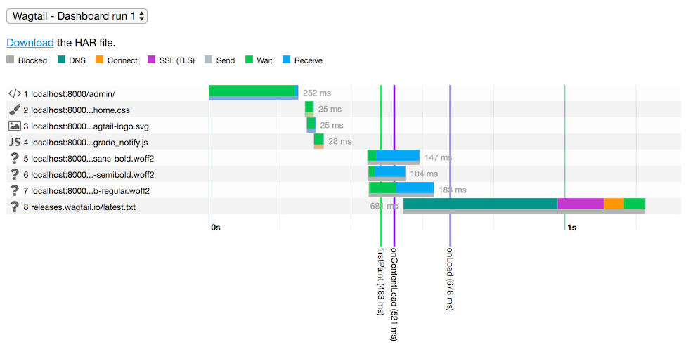

# wagtail-dev-tooling

> Advanced tooling for [Wagtail](https://github.com/wagtail/wagtail) development. See [example reports](https://springload.github.io/wagtail-dev-tooling/).

## Installation

```sh
# Get the code from the repository.
git clone git@github.com:thibaudcolas/wagtail-dev-tooling.git
cd wagtail-dev-tooling
# Install dependencies.
nvm install
npm install
# Configure environment variables.
touch .env
# Point to the location of your Firefox binary.
# See https://docs.slimerjs.org/0.8/installation.html#configuring-slimerjs.
echo "SLIMERJSLAUNCHER=/Applications/Firefox.app/Contents/MacOS/firefox" >> .env
# Configure Wagtail user session ID to use.
# Get this value by logging into the Wagtail admin of your site, then
# use the developer tools to insect the cookies, to find "sessionid".
echo "WAGTAIL_SESSIONID=yoursessionid" >> .env
```

## UI regression tests

```sh
# 1. Create UI regression reference.
npm run regression:reference
# 2. Run UI regression tests.
npm run regression:test
# 3. Open UI regression report.
npm run regression:open
```

## Web performance audits

```sh
# 1. Start the containers with graphite and grafana.
docker-compose up -d
# 2. Run the performance tests.
npm run performance:test
# 3. Open UI performance report.
npm run performance:open
# 4. Tear down the containers when you've had enough.
docker-compose stop
```

## Examples

### BackstopJS UI regression report



### Grafana dashboard displaying web performance metrics



### Sitespeed performance budget output



### Sitespeed performance metrics



### Sitespeed page load waterfall chart



## Documentation

- https://github.com/garris/BackstopJS
- http://docs.casperjs.org/en/latest/
- http://phantomjs.org/api/webpage/
- https://docs.slimerjs.org/current/api/webpage.html
- https://www.sitespeed.io/
- http://docs.grafana.org/
- https://docs.docker.com/
